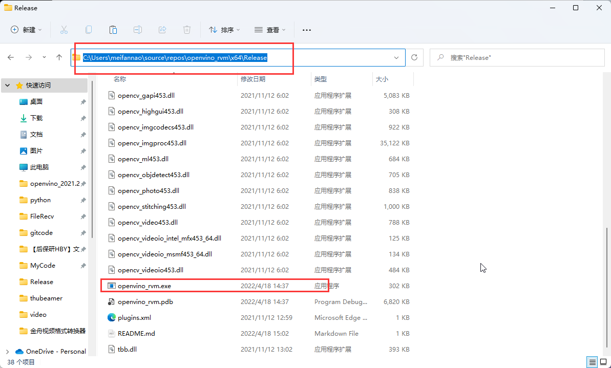
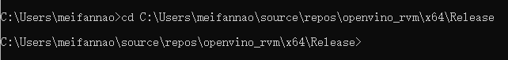
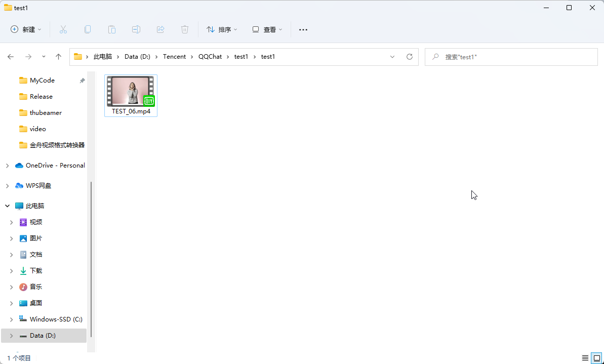
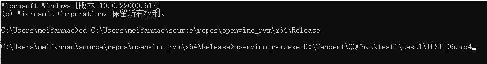
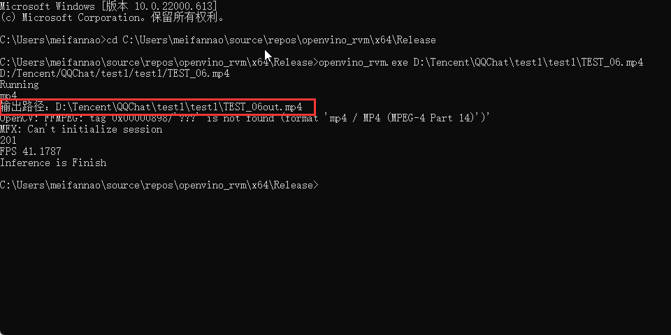
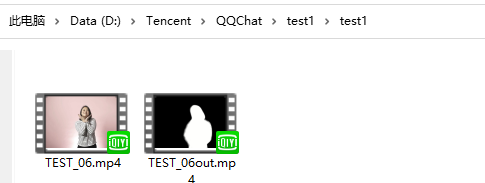
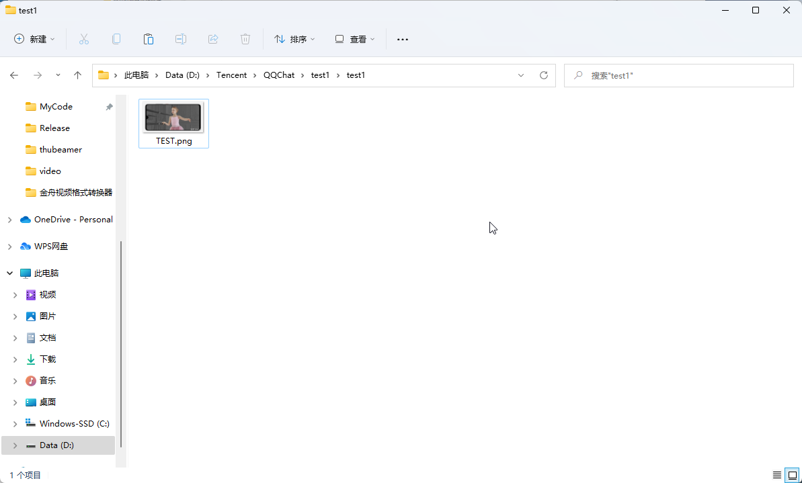
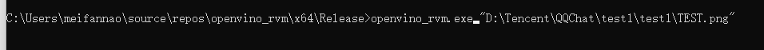
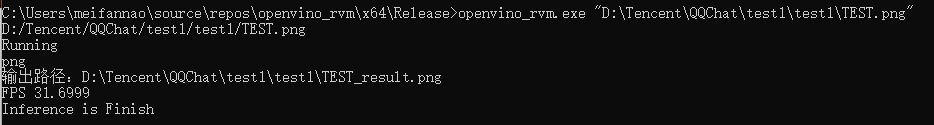
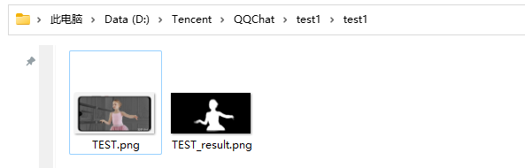

# 视频推理演示

openvino_rvm.exe所在文件夹

1.打开命令行窗口

2.复制openvino_rvm.exe所在文件夹的路径，上图中的路径为：

​	C:\Users\meifannao\source\repos\openvino_rvm\x64\Release

3.在cmd窗口输入cd C:\Users\meifannao\source\repos\openvino_rvm\x64\Release切换到openvino_rvm.exe所在文件夹下

4.找到本地视频复制其路径，如图所示路径为 

D:\Tencent\QQChat\test1\test1\TEST_06.mp4

或 D:/Tencent/QQChat/test1/test1/TEST_06.mp4

或 D:\\\Tencent\\\QQChat\\\test1\\\test1\\\TEST_06.mp4

路径前后可以有引号如 “D:\Tencent\QQChat\test1\test1\TEST_06.mp4”

5.输入openvino_rvm.exe  <path> //<path> 为上述视频路径

​	

6.回车运行，可以看到输出路径

结果

# 图片推理演示

openvino_rvm.exe所在文件夹

1.打开命令行窗口

2.复制openvino_rvm.exe所在文件夹的路径，上图中的路径为：

​	C:\Users\meifannao\source\repos\openvino_rvm\x64\Release

3.在cmd窗口输入cd C:\Users\meifannao\source\repos\openvino_rvm\x64\Release切换到openvino_rvm.exe所在文件夹下

4.找到本地图片复制其路径，如图所示路径为 

D:\Tencent\QQChat\test1\test1\TEST.mp4

或 D:/Tencent/QQChat/test1/test1/TEST.mp4

或 D:\\\Tencent\\\QQChat\\\test1\\\test1\\\TEST.mp4

路径前后可以有引号如 “D:\Tencent\QQChat\test1\test1\TEST.mp4”

5.输入openvino_rvm.exe  <path> //<path> 为上述视频或者图片路径

6.回车运行，可以看到输出路径

结果

